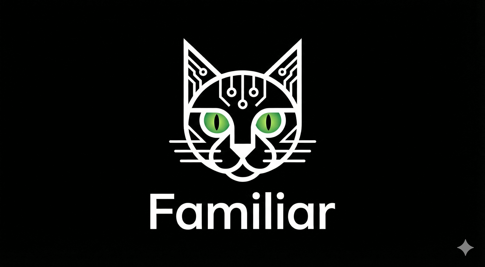

<p align="center">
  
</p>

<p align="center">
  <a href="https://www.npmjs.com/package/@bedda/familiar"></a>
  <a href="https://github.com/bedda-tech/familiar/blob/main/LICENSE"></a>
  <a href="https://github.com/orgs/bedda-tech/projects/3"></a>
</p>

A bridge between Telegram and Claude Code (`claude -p`). Gives you a persistent AI assistant on Telegram backed by Claude Code's full toolset — Bash, file ops, web search, MCP servers, session memory.

```
Telegram  ──>  Familiar (bridge)  ──>  claude -p --resume <session>
          <──                     <──  --output-format stream-json
```

## Setup

There are two paths: **fresh install** or **migrate from OpenClaw**. Choose one.

### Path A: Fresh Install

**Prerequisites**: Node.js >= 20, Claude Code CLI installed and authenticated (`claude --version` works).

```bash
# 1. Install globally from npm
npm install -g @bedda/familiar

# 2. Initialize config and workspace
familiar init
```

This creates:
- `~/.familiar/config.json` — edit this next
- `~/familiar-workspace/` — workspace with template governing docs

```bash
# 3. Edit the config — you MUST set botToken and allowedUsers
```

Open `~/.familiar/config.json` and set these two values:

| Field | How to get it |
|-------|---------------|
| `telegram.botToken` | Message [@BotFather](https://t.me/BotFather) on Telegram → `/newbot` → copy the token |
| `telegram.allowedUsers[0]` | Message [@userinfobot](https://t.me/userinfobot) on Telegram → it replies with your numeric user ID |

The config after editing should look like:

```json
{
  "telegram": {
    "botToken": "7234567890:AAH...",
    "allowedUsers": [1632355333]
  },
  "claude": {
    "workingDirectory": "/home/you/familiar-workspace",
    "model": "sonnet",
    "systemPrompt": "You are a helpful personal assistant communicating via Telegram. Keep responses concise and well-formatted for mobile reading.",
    "allowedTools": ["Bash", "Read", "Write", "Edit", "Glob", "Grep", "WebFetch", "WebSearch"],
    "maxTurns": 25
  },
  "sessions": {
    "inactivityTimeout": "24h",
    "rotateAfterMessages": 200
  },
  "log": {
    "level": "info"
  }
}
```

```bash
# 4. Start
familiar start
```

### Path B: Migrate from OpenClaw

If `~/.openclaw/` exists with a previous OpenClaw/ClawdBot setup:

```bash
# 1. Install globally from npm
npm install -g @bedda/familiar

# 2. Run migration — reads OpenClaw config, creates Familiar config, adds CLAUDE.md to workspace
familiar migrate-from-openclaw
```

The migration reads from these OpenClaw paths:
- Config: `~/.openclaw/openclaw.json` or `~/.openclaw/clawdbot.json`
- Allowed users: `~/.openclaw/credentials/telegram-default-allowFrom.json`

It creates:
- `~/.familiar/config.json` — pointing at the existing OpenClaw workspace
- `CLAUDE.md` in the workspace — Claude Code's auto-loaded root instruction file

All existing governing docs (SOUL.md, IDENTITY.md, USER.md, etc.) are left untouched.

**Not migrated** (OpenClaw-specific, not used by Familiar):
- Vector memory SQLite DB
- WhatsApp channel config
- Cron jobs / heartbeats
- Sub-agent configs

```bash
# 3. Verify config looks right
cat ~/.familiar/config.json

# 4. Start
familiar start
```

## Verification

After starting, confirm it works:

1. `familiar start` should print log lines and not exit (ctrl+c to stop)
2. Message your bot on Telegram — it should respond
3. Run `familiar tui` in another terminal — should resume the same session
4. `/status` in Telegram — should show session info

If `familiar start` crashes:
- `"Config missing required 'telegram.botToken'"` → edit `~/.familiar/config.json`, set `botToken`
- `"Config missing required 'telegram.allowedUsers'"` → set `allowedUsers` to your Telegram user ID
- `ENOENT` on `claude` → Claude Code CLI not installed or not in PATH

## Config Reference

**File**: `~/.familiar/config.json`

| Field | Type | Default | Description |
|-------|------|---------|-------------|
| `telegram.botToken` | string | **required** | Telegram bot token from BotFather |
| `telegram.allowedUsers` | number[] | **required** | Telegram user IDs allowed to use the bot |
| `claude.workingDirectory` | string | `~/familiar-workspace` | Directory where Claude Code runs; govering docs live here |
| `claude.model` | string | `"sonnet"` | Model: `"sonnet"`, `"opus"`, or `"haiku"` |
| `claude.systemPrompt` | string | *(see above)* | System prompt prepended to every `claude -p` invocation |
| `claude.allowedTools` | string[] | *(see above)* | Claude Code tools to enable via `--allowedTools` |
| `claude.maxTurns` | number | `25` | Max agentic turns per message via `--max-turns` |
| `sessions.inactivityTimeout` | string | `"24h"` | Reset session after this much inactivity. Format: `"30m"`, `"24h"`, `"7d"` |
| `sessions.rotateAfterMessages` | number | `200` | Start fresh session after this many messages |
| `log.level` | string | `"info"` | Log level: `"debug"`, `"info"`, `"warn"`, `"error"` |

## CLI Commands

```
familiar start                  Start the Telegram bot (foreground)
familiar tui                    Open Claude Code TUI, resuming the active Telegram session
familiar init                   Create ~/.familiar/config.json and workspace with templates
familiar migrate-from-openclaw  Migrate from an existing OpenClaw setup
familiar install-service        Install systemd user service for background running
familiar help                   Show help
```

### `familiar tui`

Opens the full Claude Code interactive TUI, resuming the same session that Telegram uses. This lets you switch between phone and terminal mid-conversation.

- Reads the session ID from `~/.familiar/familiar.db` (same SQLite store Telegram uses)
- Launches `claude --resume <session_id>` with `stdio: inherit`
- When you exit the TUI, the next Telegram message picks up where you left off
- If no session exists yet, starts a fresh `claude` session

## Telegram Commands

- `/new` — Clear current session, start fresh
- `/status` — Show session info (session ID, message count, age)
- `/model` — Show which model is configured

## Workspace & Governing Docs

The workspace directory (`claude.workingDirectory`) contains files that define your familiar's personality. `familiar init` creates these templates:

| File | Purpose |
|------|---------|
| `CLAUDE.md` | Root instruction file — loaded automatically by Claude Code on every invocation |
| `SOUL.md` | Core personality and philosophy |
| `IDENTITY.md` | Name, nature, emoji — filled in during first conversation via BOOTSTRAP.md |
| `USER.md` | Info about the human — filled in during first conversation |
| `AGENTS.md` | Behavioral rules |
| `TOOLS.md` | Available CLI tools and integrations |
| `BOOTSTRAP.md` | First-run onboarding script — self-deletes after setup |
| `TODO.md` | Persistent task board |
| `MEMORY.md` | Long-term curated memory |
| `memory/` | Daily notes directory (YYYY-MM-DD.md) |

On the first Telegram message, the familiar reads BOOTSTRAP.md and walks the user through choosing a name, emoji, and personality.

## Running as a systemd Service

```bash
# Install the service file to ~/.config/systemd/user/familiar.service
familiar install-service

# Enable and start
systemctl --user daemon-reload
systemctl --user enable familiar
systemctl --user start familiar

# Check status / logs
systemctl --user status familiar
journalctl --user -u familiar -f

# Stop
systemctl --user stop familiar
```

## Architecture

~15 files. 4 runtime dependencies (`grammy`, `better-sqlite3`, `pino`, `p-queue`).

```
~/.familiar/
  config.json       # Config
  familiar.db       # SQLite — session mappings and message log

~/familiar/         # Source repo
  src/
    index.ts        # CLI entry point (start, tui, init, migrate, install-service)
    config.ts       # Config loader with defaults and validation
    bridge.ts       # Message router: channel <-> Claude
    claude/
      cli.ts        # Spawns `claude -p`, parses stream-json output
      types.ts      # Stream event types
    channels/
      telegram.ts   # grammY Telegram bot
      types.ts      # Channel interface
    session/
      store.ts      # SQLite session store (better-sqlite3)
    streaming/
      chunker.ts    # Splits long responses into 4096-char Telegram messages
      draft.ts      # Edit-in-place streaming (updates message as response streams in)
    util/
      logger.ts     # pino logger
  templates/        # Workspace template files copied by `familiar init`
  dist/             # Compiled JS (after `npm run build`)
```

## Roadmap & Contributing

See the [project board](https://github.com/orgs/bedda-tech/projects/3) for tracked issues and priorities, and [ROADMAP.md](ROADMAP.md) for the full plan.

Contributions welcome — see [CONTRIBUTING.md](CONTRIBUTING.md). AI-authored contributions are welcome as long as they are tagged with `Co-Authored-By`.

## License

MIT
